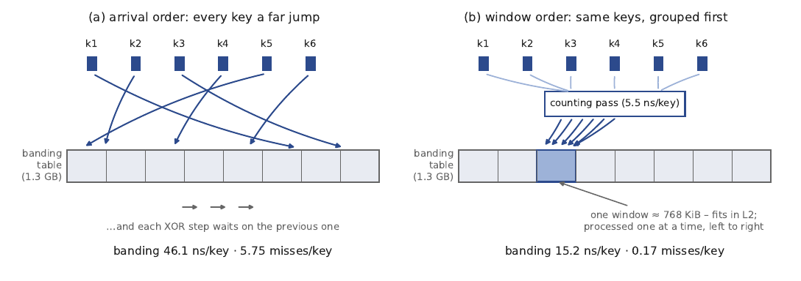
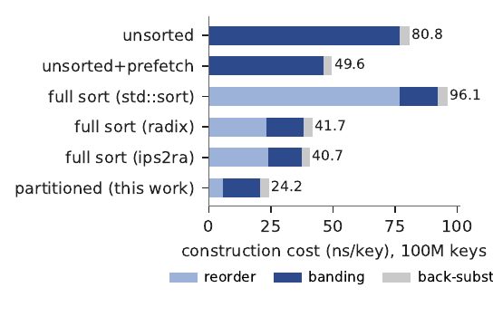
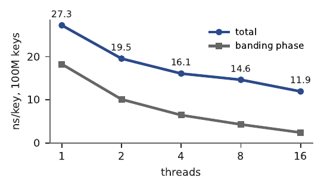
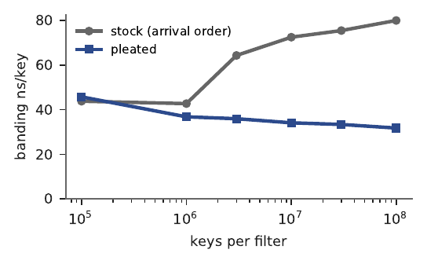

<!-- GENERATED by scripts/make_markdown.py from paper/main.tex. Edit that file, not this one. -->

# Pleated Ribbon Construction: Approximate Sorting Recovers the Locality of a Full Sort

Brian Sam-Bodden, Integrallis Software, Scottsdale, Arizona, USA

## Abstract

Probabilistic membership filters let storage systems skip reads for keys that are not present. Ribbon filters use much less memory than Bloom filters at comparable false-positive rates, but their higher construction cost limits deployment. I reduce that cost for homogeneous ribbon filters by grouping keys into approximate start-position windows with a counting-sort partition: one counting pass followed by a scatter pass. At 100–400 million keys, this recovers 98.3–98.4% of the cache-miss reduction from a full sort at about one quarter of its reorder cost and makes sequential construction 2.05–2.24× faster than the reference build. The gain comes from reducing misses in dependent row-reduction chains; batching does not help the tested Bloom construction or filter queries, whose misses are independent.

I show that banding followed by back-substitution produces the same filter under any insertion order, for a fixed hash seed and table size, whenever the system is consistent, which a homogeneous ribbon system always is; reordered builds matched the arrival-order build in every measured run and had no false negatives. A slot-range parallel implementation takes 11.9 ns/key at 100 million keys with 16 threads. The method also transfers to RocksDB’s shipped Standard128 ribbon builder, where filter construction is 1.8× faster and measured false-positive rates match stock to six digits. In the evaluated compaction configuration, the total CPU reduction is within run-to-run variation. These results apply to the evaluated filters, parameters, and machines; they do not establish a general construction or deployment crossover with Bloom.

## 1 Introduction

A membership filter is a small in-memory summary of a large key set. Ask it whether a key is present, and it answers “definitely not” or “probably yes.” The first answer is the one worth having: a database that keeps a filter in front of each data file skips reading any file whose filter says no. Bloom filters (Bloom 1970) have done this for five decades, at a cost of about 44% more memory than the theoretical minimum for a given error rate. A newer generation (xor, binary fuse, and ribbon filters) closes that gap to within 10% and to under 1% in ribbon’s bumped variants (Dillinger and Walzer 2021; Dillinger et al. 2022).

The new filters are static: each is built once over a fixed key set and never updated. That suits write-optimized databases, whose data files are immutable and are rewritten continuously by background compaction. But every rewrite also rebuilds the file’s filter, so build speed matters as much as query speed, and building is where the new filters lose. A ribbon filter costs about four times the CPU of a Bloom filter (RocksDB measures 140 vs. 32 ns per key (Dillinger 2021)), so production systems keep Bloom as the default and reserve the space-efficient filters for data they rarely rewrite. The authors of these structures report the same cost. The parallel-BuRR authors write that “\[a\] large portion of the construction time is spent on parallel sorting” (Becht et al. 2024), and a recent proposal reports building several times slower than the best existing builders (Limasset 2026).

I ask which parts of that cost are fixed by the hardware and which can be recovered. Three experiments give the same answer: reordering pays where memory stalls form data-dependent chains. Out-of-order execution and software prefetch already overlap independent stalls; they cannot overlap a chain in which each access depends on the previous one.

**Contributions.**

1.  Ribbon construction becomes about twice as fast at large sizes (§4). At scale, homogeneous ribbon banding incurs 5.8 generic hardware cache misses per key in dependent row-reduction chains, which prefetch cannot hide. The ribbon authors’ own homogeneous-ribbon algorithm already asks for the keys to be sorted by start position “at least approximately” (Dietzfelbinger et al. 2026; Dillinger et al. 2021) for a step-count reason, but the reference implementation and RocksDB band in arrival order and the step has not been implemented or measured. I implement it as a cache-sized counting-sort partition and measure it: grouping keys into L2-sized windows of start positions, with no ordering inside a window, recovers 98.3–98.4% of the miss reduction of a full start-position sort (SGAUSS (Dietzfelbinger and Walzer 2019), BuRR (Dillinger et al. 2022)), at 5.5–6.1 ns/key, where BuRR’s own ips2ra sorter costs 23.9–28.1. End to end, construction is 2.05–2.24× faster than the reference prefetch-pipelined build. The result is insensitive to window size: totals stay within 13% from $2^{13}$ to $2^{20}$ slots.

2.  The solved filter does not depend on insertion order (§6). For any consistent system, banding and back-substitution give the same filter in every order, even though the redundant keys that are dropped can differ; a homogeneous ribbon system is always consistent. This extends the ribbon authors’ observation that the set of filled slots is order-invariant. My implementation still compares each result’s FNV-1a fingerprint with the arrival-order build and checks for false negatives; the fingerprints matched in all 54 measured runs. A slot-range parallel variant that defers boundary keys (at most 0.23% of them) can therefore be checked against the sequential result with a checksum: banding is 4.25× faster at 8 threads and 7.56× at 16 against its own single-thread run (3.5× and 6.3× against the best sequential banding). The total is 11.9 ns/key at 100M keys.

3.  Two negative results support the same rule (§3). Batched probing did not win: miss-dominated point probes are limited by the number of outstanding misses a core can sustain, and software prefetch already reached about 88% of that ceiling in my measurement. Cross-key SIMD batching loses to per-key probing even with every address L1-resident. Bulk Bloom construction did not benefit either, for the same reason: its misses are independent, so the memory system already hides them. Radix-partitioned construction in the style of Schmidt et al. (2021) topped out at 1.45–1.71× over per-key insertion; a prefetch loop of the kind RocksDB ships without a published evaluation recovered most of that with no transient memory; and my read-free register-aggregated apply, the design the experiment was built around, was 1.5× slower than partitioned read-modify-write, because partitioning had already turned the target misses into L2 hits.

4.  I give what is, to my knowledge, the first evaluation of the construction prefetch that RocksDB ships behind a “TODO: verify/validate” comment (§7). It is worth 1.5–1.7× on unsorted banding, and partitioning mostly subsumes it.

5.  The technique transfers to RocksDB’s shipped Standard128 ribbon builder (§8). One counting pass makes filter construction 1.8× faster at 100M keys/filter and yields 25× fewer banding cache misses at the same instruction count. RocksDB’s tests pass, measured false-positive rates match stock to six digits, and in a separate check, all 443 filters I compared were byte-identical to stock. In the compaction configuration I evaluated, which favors filters, the filter-build gain persisted, but the reduction of about 9% in total compaction CPU was within run-to-run variation.

The primary x86 measurements use an i9-14900HX (AVX2, no AVX-512). Comparative numbers come from the field’s reference benchmark suites, run unmodified at pinned versions: fastfilter_cpp, whose ribbon implementations are the reference code of ribbon’s creator, Peter Dillinger, and BuRR. Throughout, “reference” means this reference *implementation*, which bands keys in arrival order behind a prefetch pipeline; it omits the approximate sort that the published homogeneous-ribbon algorithm lists (Dietzfelbinger et al. 2026). The only benchmark code I wrote for the homogeneous-kernel study is a thin driver that permutes the input order around the unmodified kernel. I also report ARM timing replications and a separate Graviton4 PMU follow-up (§5). Raw outputs and analyses are in the repository.

## 2 Background

**Ribbon banding.** A ribbon filter solves a banded GF(2) system. Each key hashes to a start column $s$ and a $w$-bit coefficient row, and insertion XOR-reduces that row against the rows already stored until an empty slot absorbs it. Dietzfelbinger and Walzer showed that sorting rows by start position makes banded elimination linear (SGAUSS). For standard ribbon, the ribbon paper then made the sort optional: rows can be inserted on the fly, in arbitrary order, and “\[t\]here is no need to pre-sort the keys” (Dillinger and Walzer 2021). RocksDB’s builder and the reference implementation work this way. BuRR brought the sort back (ips2ra, by bucket) because bumping needs it. Homogeneous ribbon, the variant I target, never fails construction and stores no per-key result rows. For this variant the published algorithm is not order-free. Its construction listing in the full version of the BuRR paper (Dillinger et al. 2021) has the step “sort $S$ approximately by $s(x)$”, and the accompanying proof notes that it is enough if keys are “sorted into buckets of $b$ consecutive starting positions each and buckets handled from left to right.” The unified journal treatment (Dietzfelbinger et al. 2026) keeps the step as “sort $S$ by $s(x)$”, annotated “at least approximately.” The stated reason is a bound on the row operations spent on redundant insertions, not memory locality. That bound does not limit construction in my runs: at 100M keys, banding executes 97.4 instructions per key in arrival order, 96.2 after a full sort, and 97.8 after partitioning. Order changes where banding touches memory but not how much work it does. The same papers observe that the set of filled slots does not depend on insertion order. Coarse bucketing by start position is therefore the ribbon authors’ idea. I found no implementation of it in print or in code, no cache-miss account of why it matters, and no measurement of how much of a full sort’s benefit it keeps; the reference implementation I benchmark and RocksDB both band in arrival order with a prefetch pipeline. I use *pleating* as a name for the cache-sized instance of that approximate sort.

**What the filter stores and how a query works.** A ribbon filter is an $m \times r$ bit matrix $Z$. Hashing maps each key $k$ to three values: a start position $s(k)$, a $w$-bit coefficient row $c(k)$ whose first bit is always 1, and $r$ result bits $b(k)$. The filter represents $k$ by satisfying one linear equation over GF(2): $c(k)\cdot Z = b(k)$, with $c(k)$ occupying columns $[s(k), s(k){+}w)$. A query recomputes $s$, $c$, and $b$ and answers “present” if and only if $c\cdot Z = b$. A key that was never inserted passes that test by chance with probability $2^{-r}$, which is the false-positive rate; at $r = 7$, that is just under 0.8%.

**Why banding is local.** Construction solves the linear system incrementally: each insertion XOR-reduces its row against stored rows until an empty slot absorbs it. Because a key’s coefficients span only $w$ consecutive columns, all of the work for that key happens in a run of slots beginning at $s(k)$, and the expected run is short (Dillinger and Walzer 2021). The techniques in this paper rely on that locality: grouping keys by start region confines banding’s memory traffic to one region at a time, and a thread that owns a range of slots can process every key whose run stays inside it.

**The homogeneous variant.** Homogeneous ribbon stores no per-key result rows during banding and never fails: a row that reduces to zero is dropped, trading a small false-positive elevation for guaranteed completion. My configuration throughout is $w = 64$, $r = 7$, and $m \approx 1.09n$ slots, which gives 7.63 bits per key at a measured false-positive rate of 0.81%.

**Binary fuse.** Binary fuse construction partially sorts keys by segment, explicitly to reduce cache misses (Graf and Lemire 2022); my Phase-0 characterization measures that fix directly (plain xor: 9.45 generic hardware cache misses/key; binary fuse: 1.08). This is the closest analogue to my method outside the ribbon family: a single linear pass into coarse position buckets, motivated by cache behavior, and not a full sort. Binary fuse ships the pass as part of its published construction; the ribbon implementations I measured do not have one.

## 3 Where layout tricks cannot work

This section reports two optimizations that failed. Each was tested under favorable conditions, with its protocol fixed before any run: the batched probe was timed with every address already in cache, and the read-free builder was the design its experiment was built around. Both lost. An optimization that cannot win under conditions chosen to favor it points to a limit of the hardware and not of the setup.

### 3.1 Point probes are MLP-bound

Experiment E0 compared probe strategies over identical split-block Bloom filters (Parquet geometry), 32 KiB up to 512 MiB, with the protocol frozen before any timing run. My vertical, lane-structured batch probe auto-vectorizes from plain Rust (the packed-SIMD disassembly is in the repository), yet it loses. At every size, even with every address forced L1-hot, per-key scalar probing wins (665 vs. 555 Mops/s), because a split-block check is already SIMD within a single key, and an AVX2 gather cannot beat eight independent scalar loads that the out-of-order window overlaps at no cost. At RAM scale, the identical instruction stream runs 5–6× faster when L1-hot, so probing is bound by memory-level parallelism. Prefetch already reached roughly 88% of the measured single-core ceiling on outstanding misses. No compute bottleneck remains for a layout change to remove.

### 3.2 Blocked-Bloom construction is prefetch-hidable

Experiment E1a measured five bulk builders at 1M to 429M keys, gated on bit-identical output (OR is commutative, so any deviation is a bug). Per-key insertion does degrade at scale (one random read-modify-write miss per key, 11.5 ns/key at 100M, IPC 0.48), so there is a cost to recover. Most attempts to recover it failed. Radix-partitioned construction after Schmidt et al. (2021) reached only 1.45–1.71×. A software-pipelined prefetch insert, the shape RocksDB ships, reached 6.1–8.9 ns/key with no transient memory and beat partitioning up to 100M keys. The variant this experiment was designed around is a read-free apply that partitions pre-merged (block, mask) pairs, OR-aggregates each block in registers, and issues one store per block without reading filter memory. It was 1.5× slower than partitioned read-modify-write, and non-temporal stores made no difference. The explanation is that partitioning had already turned the expensive misses into L2 hits, so the extra grouping pass spent time to save cheap loads. Bloom construction misses are independent, and the memory system already hides independent misses.

## 4 Partition-instead-of-sort for ribbon

### 4.1 The target, measured

I first measured where ribbon construction spends its time, using the reference benchmark suite unmodified (three repetitions). At 100 million keys, homogeneous ribbon construction costs 50.6 ns per key, and the hardware counters show why: the processor completes only 0.64 instructions per cycle and takes 5.81 generic hardware cache misses per key, so it spends most of its time waiting on memory. Each key starts its elimination at an effectively random position in a 1.3 GB table, and every reduction step needs the result of the previous XOR before it can compute which slot it touches next. A prefetcher cannot run ahead of such a chain. Bloom construction is the opposite case: each key’s memory accesses are independent, and the hardware overlaps them.

### 4.2 Design

I only permute the input. One counting pass buckets keys by $\lfloor s / 2^{16} \rfloor$ (windows of $2^{16}$ slots, roughly 768 KiB of banding state, under half an L2 cache), recomputing the hash on the fly instead of materializing pairs; a second pass writes the keys out in window order. The unmodified reference kernel, including its prefetch pipeline, then consumes the permuted array. Everything downstream (banding, back-substitution, queries) is reference code, so the speedup is attributable to reordering alone. Figure 1 shows the change in access pattern.

**Cost in memory.** The pass is not in place. It allocates one additional array of $n$ 64-bit keys, 8 bytes per key, which is transient and is freed after banding; the window counters are negligible, and the parallel variant copies each thread’s keys once more. Measured peak resident memory agrees: at 100M keys the pleated build peaks 8.0 bytes per key above the reference build, against 23.0 for the ips2ra sort in the same driver (Appendix D, which also states what each reported time includes).

**Figure 1.** Effect of insertion order on banding. (a) In arrival order, every key starts its elimination at a random position in a table three orders of magnitude larger than cache, and the steps within each insertion form a dependent chain no prefetcher can run ahead of. (b) A counting pass assigns keys to table windows, and a scatter pass groups them by window; banding then works inside one cache-resident window at a time. Binary fuse filters apply the same remedy to their counter scatter via a segment sort (§2). Numbers: 100M keys, means of 3 runs.

### 4.3 Results

Table 1 gives the results at 100M keys (the 400M-key runs are in the repository). The partition pass costs 5.5–6.1 ns/key against 23.9–28.1 for ips2ra in my driver (17.3 inside BuRR’s own benchmark). Banding after partitioning is within 13% of banding after a full sort (15.2 vs. 13.4 ns/key); that is, the partition recovers 98.3–98.4% of the sort’s miss reduction (5.75 → 0.17 vs. 0.075 misses/key). End to end, construction takes 24.2 ns/key against 49.6 for the reference and 40.7 for the best full sort, which is 1.68× faster than the best full sort at both sizes. BuRR is included only as a mechanistic anchor: it uses a different, bumped structure (r=8, about 1% space overhead) than my homogeneous configuration (7.63 bits/key at 0.81% FPR, about 9.5% overhead), so its end-to-end number is not a like-for-like comparison. A window sweep from $2^{13}$ to $2^{20}$ slots moves totals only between 23.8 and 26.9 ns/key, and my registered choice of $2^{16}$ was conservative: $2^{14}$ is slightly faster (Figure 2).

| strategy | reorder | banding | total | cache-misses/key |
|:---|---:|---:|---:|---:|
| unsorted, no prefetch | — | 76.9 ± 4.3 | 80.8 ± 4.2 | 5.81 |
| unsorted + prefetch (ref.) | — | 46.1 ± 1.4 | 49.6 ± 1.4 | 5.75 |
| full sort (std::sort) | 76.8 ± 7.1 | 15.5 ± 2.2 | 96.1 ± 8.9 | 0.074 |
| full sort (LSD radix) | 23.4 ± 1.9 | 14.7 ± 0.8 | 41.7 ± 1.2 | 0.076 |
| full sort (ips2ra) | 23.9 ± 0.1 | 13.4 ± 0.1 | 40.7 ± 0.3 | 0.075 |
| **partitioned (this work)** | **5.5 ± 0.1** | 15.2 ± 0.1 | **24.2 ± 0.2** | 0.170 |
| parallel, 8T (this work) | 5.5 | 4.3 ± 0.4 | 14.6 ± 2.1 | — |
| parallel, 16T (this work) | 5.7 | 2.4 ± 0.4 | **11.9 ± 0.8** | — |

**Table 1.** Homogeneous ribbon construction, 100M keys, ns/key (mean ± sample stdev over 3 reps; parallel rows 2 reps; raw artifacts in repository). Banding perf counters scoped to the banding phase. The miss/key column is Linux’s generic hardware cache-miss event on x86, not a direct count of DRAM transactions.

**The remaining gap to Bloom.** In the same harness and at close false-positive rates, ribbon construction goes from 4.4× the cost of blocked Bloom to 2.2×: pleating roughly halves the gap but does not close it (Appendix E, Table 6). The comparisons against a production Bloom builder and at equal thread counts are in §8 and §6.

**Figure 2.** Construction cost by phase, 100M keys. The partition pass replaces the sort at 4× lower reorder cost, while banding stays within 13% of banding after a full sort.

## 5 Portability across architectures

I repeated the construction measurements on two ARM cores: an Ampere Altra (Neoverse-N1, NEON) and a Google Axion (Neoverse-V2, SVE), each on a cloud host with at most eight cores. Table 2 gives wall-clock results at 100M keys. Pleating is faster on all three architectures, by a wider margin on the ARM cores: 2.05× over the reference build on x86, 2.37× on N1, and 2.72× on V2. This is consistent with the mechanism: the less effectively a core hides the dependent-chain misses, the more removing them helps, and the reference banding cost follows the same order (46, 114, and 86 ns/key on x86, N1, and V2). Parallel construction scales near-linearly on the eight-core V2: banding speeds up 1.94/3.78/7.07× at 2/4/8 threads, for a 17.3 ns/key total (one run per thread count, so no variance estimate).

The output checks passed on all three architectures. At each of the nine (size, seed) points, the 64-bit FNV-1a solution fingerprint matched across the Axion, x86, and N1 builds; every strategy also matched the sequential build’s fingerprint. These are empirical hash comparisons, not direct bytewise comparisons, and the order-related part is what Proposition 1 predicts. Identity across machines additionally reflects that the hashing and the GF(2) arithmetic are deterministic. There were zero false negatives on every run.

A separate Graviton4 run with counter access measures the mechanism on Neoverse-V2: the partition recovers 96.8% of the full sort’s L2 read-miss reduction (Appendix E).

|  | x86 Raptor Lake | N1 (NEON) | V2 (SVE) |
|:---|---:|---:|---:|
| reference | 49.6 ± 1.4 | 122.8 ± 0.3 | 93.7 ± 0.5 |
| best full sort | 40.7 ± 0.3 | 64.6 ± 0.3 | 44.8 ± 0.3 |
| **partitioned** | **24.2 ± 0.2** | **51.7 ± 0.3** | **34.4 ± 0.0** |
| pleating vs reference | 2.05× | 2.37× | 2.72× |

**Table 2.** Construction across architectures, 100M keys, wall-clock ns/key (mean ± sample stdev over 3 reps). These original cross-architecture runs report timing and output checks; the separate Graviton4 PMU follow-up is described in the text.

## 6 Order-independence and parallel construction

**Proposition 1** (Order-independence). *Let $E=\{(r_k,b_k)\}$ be a consistent system of equations over $\mathrm{GF}(2)$ in $m$ unknowns, for one fixed hash seed and table size, each $r_k$ carrying a leading 1 at its start position. Then banding (reduce each row against the stored rows, store it at the slot of its leading position, and drop it if it reduces to zero) followed by back-substitution in which every free slot $j$ is assigned a value $g(j)$ that depends only on $j$ (not on the table’s contents or on the insertion history) yields the same solution $Z$ under every insertion order of $E$.*

The rows need not be linearly independent. A homogeneous ribbon system has $b_k=0$ for every key and is therefore always consistent, so a homogeneous ribbon filter does not depend on insertion order at all. In the kernels I use, a standard ribbon build for a given seed fails only when a row reduces to zero with a nonzero right-hand side, so it succeeds exactly when its system is consistent, and that too is a property of $E$, not of the order: if $E$ is inconsistent, every order meets such a row. The proposition does not cover schemes that bump or give up on keys depending on their position in the order, as BuRR does.

The first step of the proof is known: the ribbon papers state that the set of filled slots is invariant under insertion order (Dillinger and Walzer 2021; Dietzfelbinger et al. 2026). I extend that observation to the solved filter; the argument and the checks I ran on it are in Appendix A. The measurements agree: across every homogeneous sequential and parallel run (sizes up to 400 million keys, six insertion orders, up to 16 threads) the finished filter’s 64-bit FNV-1a fingerprint matched the arrival-order build, and all 443 RocksDB standard ribbon filters I compared were byte-identical to stock (§8). I keep the per-run fingerprint comparison in the implementation as a guard against bugs, not because the result depends on it. My parallel version assigns disjoint window ranges (split at the same key count) to threads; keys starting in $2^{14}$ slots of a range boundary switch to a sequential tail (0.015–0.226% of keys), following the boundary handling of parallel BuRR. BuRR makes shards independent by bumping every key whose equation spans a shard boundary to the next layer (Dietzfelbinger et al. 2026; Becht et al. 2024); a ribbon without bumping has no next layer, so I defer those keys within the same system instead. Safety does not rest on that margin: a thread never writes at or beyond the upper boundary of its range, and a reduction that would reach it is handed to the sequential tail instead (Appendix D). Banding scales 1.81/2.83/4.25/7.56× at 2/4/8/16 threads against its own single-thread run (Figure 3), or 3.5/6.3× at 8/16 threads against the best sequential banding, because the parallel path carries about 20% overhead for deferring and copying keys. The counting pass (5.7 ns/key) and back-substitution (3.8 ns/key at 16 threads) remain sequential and together account for most of the 11.9 ns/key total. Both can be parallelized, the counting sort directly and back-substitution as in parallel BuRR; I leave both to future work.

**Against Bloom at equal thread counts.** Bloom insertion is order-free and parallelizes with little effort, so a 16-thread ribbon build should be compared with a 16-thread Bloom build. In a registered experiment on a 16-core machine, pleated ribbon costs 4.0× the best Bloom build at one thread and 10.1× at 16. The gap widens because only banding is parallel in my build (Appendix C, Table 5).

**Figure 3.** Slot-range parallel construction, 100M keys; every point has a matching 64-bit solution fingerprint against the sequential build.

## 7 Construction prefetch, evaluated

RocksDB ships a software-pipelined construction prefetch behind a comment reading “TODO: verify/validate”, and the reference harness enables the same pipeline above 1500 slots. My no-prefetch control isolates its effect: 1.5–1.7× on unsorted banding (76.9 → 46.1 ns/key at 100M). The prefetch removes the miss that locates a key’s start but cannot shorten the dependent reduction chain, which is why partitioning dominates here while a similar prefetch strategy wins for Bloom construction (§3).

## 8 Pleating a production engine: RocksDB

The measurements so far use a reference-kernel harness on homogeneous $w=64$ ribbon. The filter that RocksDB ships is different: `Standard128RibbonBitsBuilder`, a *standard* (bumped-capable) ribbon at $w=128$ (Dillinger 2021). I therefore tested whether pleating transfers to it in RocksDB’s own build path. The patch is one counting pass over the collected key hashes, inserted immediately before RocksDB’s banding call (`ResetAndFindSeedToSolve`); everything downstream is unmodified engine code. As written, the patch is not in place: it holds a second copy of the collected 64-bit hashes and a 32-bit window index per key, 12 bytes (96 bits) per key of transient memory, where RocksDB reports about 230 bits per key of temporary memory for ribbon construction (Dillinger 2021). In `filter_bench` at 100M keys per filter the process peaks at 4.6 GB with the pass and 3.6 GB without (Appendix D). An integration meant for upstream would need to reduce that and to bypass the pass for small filters. Proposition 1 applies to this builder one seed at a time: whether a seed succeeds does not depend on order, so the same seed is selected, and the solution for that seed is the same (§6). This depends on where the pass is placed. RocksDB derives the starting seed and the filter length from the first collected hash, and my reorder runs after both are fixed; a reorder placed earlier could change them. I also tested the output directly. RocksDB’s own filter tests pass unchanged, and the measured false-positive rate matches stock to six digits at every reported size. That gate alone does not establish bit identity, so I checked identity directly in a separate registered experiment (E5): the same binary dumps every finished filter, and I compared stock and pleated output byte by byte at 100K, 1M, 10M, and 100M keys per filter, with a second stock run as a determinism control. All 443 filters were byte-identical, and the control matched. The comparison covers the stored metadata, including the hash seed, so the same seed was selected in every case, and byte-identical filters answer every query identically. This holds for the filters built in that experiment; it is not a proof for all inputs. Every measurement is gated on a binary confirmed to contain the patch (object recompiled, binary newer than source, marker string present), because an early build failure had left a stale stock binary in place.

**Construction microbenchmark** (`filter_bench`, the engine’s own tool; 10 bits/key). Table 3 reports total filter-construction cost, while Figure 4 plots the banding phase alone. At 100M keys per filter, pleating builds RocksDB’s ribbon 1.8× faster overall. The pleated build cost is nearly flat with filter size (54.4–55.5 ns/key from 1M to 100M keys), while the stock build cost rises from 55.9 to 97.4 ns/key as the banding table outgrows the cache. Below the cache crossover (a filter of $10^5$ keys fits in cache), pleating is a few percent *slower* because the counting pass has a cost and there is no locality to recover, as the mechanism predicts.

**Mechanism.** The cause is the same dependent-miss chain, which I confirm with hardware counters scoped to RocksDB’s banding call. At 100M keys, pleating reduces banding cache misses from 11.5 to 0.47 per key (a 25× reduction) while the instruction count is unchanged (243 per key in both builds). The work is the same; the working set now fits in cache. Two things differ from the $w=64$ case, and both follow from the mechanism. First, standard $w=128$ spends about 243 instructions per key against about 98 for homogeneous $w=64$ (128-bit $\mathrm{GF}(2)$ reductions plus a per-seed rehash), so a larger share of each key’s time is computation that no layout change can remove. This is why the *time* speedup is 1.8× here against 2.05× for $w=64$, even though the miss reduction is comparable. Second, RocksDB’s shipped construction prefetch (§7) attacks the same start-locating miss; pleating subsumes it (pleated construction is unchanged whether the prefetch is on or off), consistent with the homogeneous finding that partitioning makes the prefetch redundant.

**End-to-end during compaction.** In `db_bench`, banding inside compaction drops from 77.6 ± 1.5 to 44.2 ± 6.1 ns/key, and filter banding is about 23% of compaction CPU in the configuration tested. Total compaction CPU falls by about 9%, which is within run-to-run variation, so I report the whole-compaction effect as directional only (Appendix E).

| keys/filter                  | stock ns/key | pleated ns/key |            speedup |
|:-----------------------------|-------------:|---------------:|-------------------:|
| $10^5$ (cache-resident)    |         57.6 |           59.4 |     0.97× |
| $10^6$                     |         55.9 |           54.4 |     1.03× |
| $10^7$                     |         88.7 |           54.7 |     1.62× |
| $10^8$ (paper regime)      |     **97.4** |       **54.8** | **1.78×** |
| banding misses/key @$10^8$ |         11.5 |           0.47 |                  — |

**Table 3.** Pleating RocksDB’s shipped Standard128 ribbon (`filter_bench`, 10 bits/key, i9-14900HX; means of 3). The measured false-positive rate matches stock to six digits at every size. Banding generic hardware cache misses/key from counters scoped to the banding call.

**Against RocksDB’s own Bloom.** At a matched false-positive rate in the same harness, the pleated builder costs 2.4× RocksDB’s production Bloom builder at 100M keys per filter, down from 4.5× for stock; below the cache crossover, pleating does not help. The registered experiment, on a second x86 machine, is in Appendix B (Table 4).

**Figure 4.** RocksDB Standard128 ribbon banding-phase cost vs. filter size. Pleated banding cost stays flat (cache-resident per window); stock banding degrades as the table outgrows cache. Measured false-positive rates match stock to six digits at every point.

## 9 Related work

Sorted banded elimination: Dietzfelbinger and Walzer (2019), BuRR (Dillinger et al. 2022), and parallel BuRR (Becht et al. 2024); the unified journal treatment of standard, homogeneous, and bumped ribbon is Dietzfelbinger et al. (2026). Approximate sorting of homogeneous-ribbon input into buckets of consecutive start positions is specified there and in Dillinger et al. (2021), with a row-operation bound as its rationale (§2). Arbitrary-order banding and production engineering: ribbon (Dillinger and Walzer 2021), RocksDB (Dillinger 2021). Cache-conscious filter design: buffered Bloom filters (Canim et al. 2010), radix-partitioned filters (Schmidt et al. 2021), binary-fuse segment sort (Graf and Lemire 2022), and xor-filter buffered scatter (Graf and Lemire 2020); sharding the structure itself for construction locality in hypergraph-based static functions (Genuzio et al. 2016; Vigna 2025) and sort-based cache-oblivious peeling (Belazzougui et al. 2013); the generic two-phase partition-then-accumulate pattern appears as propagation blocking (Beamer et al. 2017) with write-combining from Wassenberg and Sanders (2011). SIMD probe-side layout: Polychroniou and Ross (2014), Lang et al. (2019), split-block Bloom (Apple 2021). My contribution is an implementation and a measurement, not the ordering idea. BuRR sorts fully (ips2ra) to enable threshold-based bumping and tighter space, and bumping needs that order, so I make no claim that a coarse partition transfers to BuRR. For homogeneous ribbon, the authors specify an approximate sort, but the implementations I found do not perform one. I build it as a counting-pass partition sized to the cache, show that it captures 98% of the sort’s locality at 4× less reorder cost, explain the gain by dependent-miss chains, and apply the same pass to RocksDB’s standard ribbon builder, whose design forgoes sorting. Unlike sharding, the partition only permutes the input and leaves the stored structure unchanged, which makes the transformation and its parallelization checkable against the arrival-order build.

## 10 Limitations and threats to validity

I characterize the miss mechanism primarily with x86 hardware counters; a separate AWS Graviton4 run also measures the Neoverse-V2 L2 read-miss event (§5). Since the ARM event differs from the x86 generic cache-miss event, I compare reductions within each machine and do not pool absolute counts. The original ARM timing replications confirm wall-clock speedups and matching output fingerprints. I accelerate the *homogeneous* ribbon (about 9.5% space overhead at $r=7$), whereas BuRR has under 1% overhead; BuRR is a mechanistic anchor, not a like-for-like baseline. The sort baselines use BuRR’s sequential ips2ra but not its parallel form. The partition pass needs transient memory (8 bytes per key in the standalone driver, 12 in the RocksDB patch); peak memory and concurrent builds were measured on one machine only, with separate processes standing in for an engine’s concurrent compactions. My parallel comparison is limited to banding, and its headline ratios are against the parallel path’s own single-thread run. The order-independence proposition is given as a proof sketch (Appendix A), with the full argument in the repository; it agrees with every measured fingerprint, with a test on the unmodified kernel, and with an exhaustive enumeration of small systems, but it has not been independently reviewed. The RocksDB construction gain is measured on the production $w=128$ kernel; byte identity with stock is shown for the 443 filters I compared, not for all inputs. The whole-compaction result comes from one configuration that favors filters: the measured reduction is directional, falls within run-to-run variation, and depends on SST sizing.

## 11 Conclusion

In the measured configurations, a counting-sort partition recovers 98% of the full sort’s cache-miss reduction for homogeneous ribbon construction at about a quarter of the reorder cost. Reordering does not change the output: for a fixed hash seed and table size, the solved filter is the same in every insertion order for any consistent system, which covers every homogeneous build and every successful standard build, and the measured fingerprints agree. The method also speeds up RocksDB’s shipped $w=128$ ribbon builder by 1.8× at 100M keys per filter. RocksDB’s tests pass, measured false-positive rates match stock to six digits, and all 443 stock and pleated filters compared in a separate experiment were byte-identical. The measured whole-compaction change is directional and configuration-dependent. Against RocksDB’s own Bloom builder at a matched false-positive rate, pleated ribbon still costs 2.4× as much to build at 100M keys per filter (4.5× for stock) on one thread. With both builds parallel, the gap is wider, 10.1× at 16 threads, because only banding is parallel in my build. These results hold for the evaluated filters and machines; they narrow ribbon’s single-thread build-cost gap to Bloom but do not close it.

## Artifacts

All protocols, amendments, raw measurements, and integrity tooling are in the accompanying repository (<https://github.com/integrallis/pleated-ribbon-construction>). `reproduce.sh` re-derives the E0 through E6 analyses from committed raw measurements, checks the Rust tests and artifact integrity, and regenerates figures. It does not rerun the measurements themselves; the registered protocols and runners for those are in the repository. A production implementation of pleated construction (differentially gated byte-for-byte against the reference kernel) is released as the `pleat` crate at <https://github.com/integrallis/pleat>.

## Appendix A. Proof of Proposition 1 and checks

*Proof sketch.* The first step is known: the ribbon papers state that the set of filled slots is invariant under insertion order (Dillinger and Walzer 2021; Dietzfelbinger et al. 2026). I extend that observation to the solved filter. (i) In any order, the stored rows have distinct leading positions and are never modified once stored; a stored row is its original row plus rows stored earlier, and a row is dropped only if it already lies in the span of the stored rows. So the stored rows are a basis of $V=\mathrm{span}\{r_k\}$, and the occupied slots, which number $\dim V$ and are all leading positions of vectors in $V$, are exactly the canonical pivot set of $V$. (ii) Every stored equation is a sum of equations of $E$, so each solution of $E$ satisfies the stored system; conversely, each dropped equation has its row in the span of the stored rows and, because $E$ is consistent, its right-hand side is the same combination of theirs, so the stored system implies all of $E$. The two solution sets coincide in every order. (iii) Pinning the order-independent free coordinates to $g(j)$ leaves a full-rank system with a unique solution. The reference implementation satisfies the condition on $g$: it fills free solution rows with a fixed multiplicative hash of the slot index, as the ribbon authors describe (Dietzfelbinger et al. 2026); zero is the special case $g\equiv 0$. Which keys are dropped as redundant does depend on the order, as the same authors note; the solution does not. (Full argument in the repository, `docs/order-independence-proof.md`.)

I tested the statement in three ways beyond the measurements in the main text. On the unmodified reference kernel, homogeneous filters sized so that up to half of the keys are dropped as redundant came out identical under 25 shuffled orders, and standard builds either succeeded identically in every order or failed in every order. A small independent model of banding gave the same solution under every permutation of systems with redundant rows, while most control systems with arbitrary right-hand sides did not. An exhaustive enumeration of all small systems (up to seven slots and five or six equations, every insertion order) found no violation. These checks support the proof but do not replace it.

## Appendix B. Bloom and ribbon in RocksDB at matched false-positive rate

Table 3 compares ribbon with ribbon. To compare both with Bloom, I registered a further experiment (E3) before collecting data: `filter_bench` building RocksDB’s production Bloom filter (`format_version` 5, which ships its own construction prefetch) and Standard128 ribbon, stock and pleated, from the same key stream at the same bits-per-key setting, three repetitions, arms interleaved. RocksDB sizes its ribbon to the Bloom filter’s false-positive rate, so the arms are matched by construction: measured rates were 0.96–0.97% for Bloom and 0.95–0.96% for ribbon, with ribbon storing 27–30% fewer bits per key. This run used a different machine from Table 3 (AMD EPYC-Milan, 8 dedicated vCPUs under KVM), so its absolute numbers are not comparable with that table; all three arms ran there in one session. Table 4 gives the result. At 100M keys per filter, the pleated builder costs 2.4× the Bloom builder, down from 4.5× for stock; at 10M it is 4.1×, down from 7.3×. Below the cache crossover pleating does not help (5.2× against 5.0× at 100K). I had registered two statements in advance. The first, that pleated ribbon would remain more than 1.5× Bloom at 10M keys and above, holds. The second, that it would come within 1.25× of Bloom at 100M, fails, as I expected. At one thread and matched accuracy, pleating therefore narrows ribbon’s build-cost gap to Bloom and leaves a factor of 2.4 at the largest size. Part of the narrowing at 100M is Bloom’s own cost rising with filter size on this machine (15.9 to 37.1 ns/key). The stock-to-pleated speedup replicates on this second x86 machine: 1.77× at 10M and 1.86× at 100M.

| keys/filter | Bloom | stock | pleated |   stock/Bloom | pleated/Bloom |         FP% |
|------------:|------:|------:|--------:|--------------:|--------------:|------------:|
|     100,000 |  15.9 |  78.9 |    82.2 | 5.0× | 5.2× | 0.97 / 0.95 |
|   1,000,000 |  20.2 |  94.2 |    83.4 | 4.7× | 4.1× | 0.97 / 0.95 |
|  10,000,000 |  22.6 | 164.6 |    92.9 | 7.3× | 4.1× | 0.96 / 0.96 |
| 100,000,000 |  37.1 | 167.8 |    90.3 | 4.5× | 2.4× | 0.97 / 0.95 |

**Table 4.** RocksDB `filter_bench` build cost (ns/key, means of 3) for the production Bloom filter and Standard128 ribbon, stock and pleated, at 10 bits/key setting (experiment E3, protocol registered before data; AMD EPYC-Milan, 8 dedicated vCPUs, KVM). Last column: measured false-positive rate %, Bloom / ribbon.

## Appendix C. Bloom and ribbon at equal thread counts

A 16-thread ribbon build should be compared with a 16-thread Bloom build, and Bloom insertion is order-free, so it parallelizes with little effort. I registered that comparison (E4) before collecting data and ran it on one machine in one session: an AWS c7a.4xlarge (AMD EPYC 9R14, 16 physical cores), 100M keys. The Bloom side is my blocked-Bloom prototype with three parallel builders (block-range partitioning, atomic ORs on a shared filter, and per-range scanning), each gated on bit-identical output to per-key insertion; at each thread count I take the fastest, so the baseline is the strongest I could build. The ribbon side is the unmodified driver of Table 1. Table 5 gives the result. At one thread, ribbon costs 4.0× the best Bloom build; at 16 threads, it costs 10.1× (22.2 against 2.20 ns/key). The gap widens with threads because my build parallelizes only banding: on this machine the sequential counting pass and back-substitution alone cost about 20 ns/key, and the ribbon total improves 1.8× from 1 to 16 threads, where Bloom improves 4.6×. Both registered statements turned out as expected: ribbon stays above 1.5× Bloom at every thread count, and it does not come within 1.25× at 16 threads. This comparison is not matched on space or false-positive rate (Bloom at 10 bits/key and 1.27% measured false positives, ribbon at 7.63 bits/key and 0.83%), and the prototype’s sequential build is 22% slower than the reference suite’s blocked Bloom on this machine, inside the 25% tolerance I had set for using its numbers. Parallel banding alone is therefore not enough: closing the equal-thread gap would also require parallelizing the counting pass and back-substitution.

| threads | best Bloom builder | Bloom ns/key |     ribbon ns/key |   ribbon/Bloom |
|--------:|:-------------------|-------------:|------------------:|---------------:|
|       1 | par_scan_t1        |        10.01 | 40.30 ± 0.05 |  4.0× |
|       2 | par_scan_t2        |         8.14 | 33.89 ± 0.22 |  4.2× |
|       4 | par_range_t4       |         5.47 | 27.09 ± 0.15 |  5.0× |
|       8 | par_range_t8       |         3.30 | 23.83 ± 0.03 |  7.2× |
|      16 | par_atomic_t16     |         2.20 | 22.15 ± 0.07 | 10.1× |

**Table 5.** Equal-thread construction cost at 100M keys (experiment E4, protocol registered before data; AWS c7a.4xlarge, AMD EPYC 9R14, 16 physical cores). Bloom: the fastest of three parallel blocked-Bloom builders at that thread count (10 bits/key; Criterion mean). Ribbon: pleated homogeneous ribbon total (mean ± sample stdev of 3; sequential build at one thread).

## Appendix D. Timing scope, memory, and parallel boundary safety

**What the timings include.** In the standalone driver, the reorder time includes allocating the permuted array and both passes of the partition, with the hash recomputed in each. Banding and back-substitution times include hashing. Key generation and the allocation of the banding table are outside the timers for every strategy. In RocksDB, `filter_bench`’s build time covers adding the keys and finishing the filter, which includes hashing, the partition pass, any seed retries, and allocation.

**Measured memory and concurrent builds.** A further registered experiment (E6) measured peak resident memory and concurrent builds on one machine (AWS c7a.4xlarge, AMD EPYC 9R14, 16 physical cores), at 100M keys, three repetitions each. In the standalone driver the whole process peaks at 1.6 GB for the reference build and 2.4 GB for the pleated build, a difference of 8.0 bytes per key, as the code predicts. The ips2ra sort in the same driver adds 23.0 bytes per key, because it sorts pairs of start position and key, and the 16-thread parallel build adds 15.1. These peaks include the input keys and the verification pass, so only the differences are attributable to reordering. In RocksDB’s `filter_bench` at 100M keys per filter the process peaks at 3.6 GB for stock and 4.6 GB with the pass; that tool varies the keys per filter and holds its finished filters, so I report the peaks and not a per-key figure. Compaction usually builds several filters at once, so the same experiment ran 1, 4 and 8 sequential builders at the same time, each pinned to its own core. The pleated build was 2.02×, 2.16× and 2.20× faster per process than the reference build: the advantage does not shrink when builders compete for memory bandwidth and the shared cache.

**Boundary safety.** The $2^{14}$-slot margin by which keys near a range boundary are deferred is a heuristic, not the safety argument. Safety rests on a hard cap: a thread loads and stores only slots below the upper boundary of its range, and a reduction that would reach that boundary stops without writing and hands its key to the sequential tail. Reductions only move toward higher slots, and every key a thread processes starts inside its own range, so no thread touches a slot below its range either. With the default margin, no reduction reached the cap in any run that recorded the count. To exercise the fallback, E6 reran the parallel build at 2 and 16 threads with the margin reduced to 1024, 64, 8 and 0 slots. With margins of 8 and 0, up to 138 reductions in a run reached the cap and were handed to the tail; in all 30 runs the filter was identical to the sequential build and there were no false negatives. Because the tail re-inserts deferred keys into the same system, Proposition 1 applies.

## Appendix E. Additional measurements

**Same-harness comparison with blocked Bloom.** Table 6 compares the ribbon builds with the reference suite’s blocked Bloom in the same harness, on the same machine, at the same key count, on one thread, and at close false-positive rates (0.94% and 0.82%), with the ribbon using 29% fewer bits per key. Ribbon construction goes from 4.4× the cost of Bloom to 2.2×. Pleating roughly halves the gap but does not close it. A per-key blocked Bloom is not the fastest Bloom build: my own prefetch-pipelined builder reaches 7.35 ns/key, but it builds a weaker filter (1.27% false positives at 10 bits/key, measured at 1M keys) in a different harness, so I do not tabulate it. The comparison against a production Bloom builder with construction prefetch, at a matched false-positive rate, is in §8 (Table 4). The equal-thread comparison with parallel Bloom builds is in §6 (Table 5).

| build | harness | ns/key | FPR% | bits/key | vs. Bloom |
|:---|:---|---:|---:|---:|---:|
| blocked Bloom, per-key | fastfilter_cpp | 11.21 ± 1.08 | 0.94 | 10.67 | 1.0× |
| homogeneous ribbon, reference | fastfilter_cpp kernel | 49.58 ± 1.43 | 0.82 | 7.63 | 4.4× |
| homogeneous ribbon, pleated | fastfilter_cpp kernel | 24.17 ± 0.21 | 0.82 | 7.63 | 2.2× |

**Table 6.** Construction cost of blocked Bloom and homogeneous ribbon at 100M keys, single thread, i9-14900HX, same harness, joined from the raw artifacts of E1b (no new runs); ns/key is mean ± sample stdev over 3 reps. Last column: cost relative to the Bloom build.

**Counter measurement on ARM.** A separate AWS Graviton4 run (Neoverse-V2, eight vCPUs) enabled user-space PMU access and measured one Neoverse-V2 event scoped to the banding call (`l2d_cache_lmiss_rd`). The median L2 read misses per key were 1.770 for the reference, 0.058 for partitioned construction, and 0.001 for LSD radix sort; the partition recovers 96.8% of the full sort’s miss reduction. This is a mechanism check on a second Neoverse-V2 host, separate from the Google Axion timing results above. The event is microarchitecture-specific, and its absolute counts are not directly comparable with the x86 event.

**Compaction in `db_bench`** (`fillrandom` 30M keys, then full compaction, 8-byte values and 256 MB target SSTs, so filters are a meaningful share of compaction; three repetitions). Filter construction runs during background compaction, so it is not on the write path, and write throughput is unchanged. The filter-build speedup persists inside compaction: banding drops from 77.6 ± 1.5 to 44.2 ± 6.1 ns/key (means of 3); the isolated, uninstrumented build shows a larger ratio, which the statistics instrumentation compresses here. Filter banding is about 23% of compaction CPU in this configuration (1.83 s of 7.9 s). The whole-compaction result is weaker: total compaction CPU falls by about 9% (7.9 ± 0.8 → 7.2 ± 0.4 s), but that difference is of the same order as the run-to-run variance of compaction, which is nondeterministic, so I report it as directional only. The effect also grows with per-SST filter size and vanishes below the cache crossover, so its magnitude depends on SST sizing, and this configuration is at the end of that range that favors filters.

## References

- Apple, Jim. 2021. *Split Block Bloom Filters*. arXiv:2101.01719; Apache Parquet format specification.
- Beamer, Scott, Krste Asanović, and David Patterson. 2017. “Reducing PageRank Communication via Propagation Blocking.” *IPDPS*.
- Becht, Christopher, Hans-Peter Lehmann, and Peter Sanders. 2024. *Brief Announcement: Parallel Construction of Bumped Ribbon Retrieval*. arXiv:2411.12365.
- Belazzougui, Djamal, Paolo Boldi, Giuseppe Ottaviano, Rossano Venturini, and Sebastiano Vigna. 2013. *Cache-Oblivious Peeling of Random Hypergraphs*. arXiv:1312.0526.
- Bloom, Burton H. 1970. “Space/Time Trade-Offs in Hash Coding with Allowable Errors.” *CACM* 13 (7).
- Canim, Mustafa, George A. Mihaila, Bishwaranjan Bhattacharjee, Christian A. Lang, and Kenneth A. Ross. 2010. “Buffered Bloom Filters on Solid State Storage.” *ADMS@VLDB*.
- Dietzfelbinger, Martin, Peter C. Dillinger, Lorenz Hübschle, Peter Sanders, and Stefan Walzer. 2026. “Ribbon: Fast Succinct Static Retrieval and Approximate Membership.” *J. ACM* 73 (1).
- Dietzfelbinger, Martin, and Stefan Walzer. 2019. “Efficient Gauss Elimination for Near-Quadratic Matrices with One Short Random Block Per Row, with Applications.” *ESA*.
- Dillinger, Peter C. 2021. *Ribbon Filter*. RocksDB blog, rocksdb.org/blog/2021/12/29/ribbon-filter.html.
- Dillinger, Peter C., Lorenz Hübschle-Schneider, Peter Sanders, and Stefan Walzer. 2021. *Fast Succinct Retrieval and Approximate Membership Using Ribbon*. arXiv:2109.01892 (full version of the SEA 2022 paper).
- Dillinger, Peter C., Lorenz Hübschle-Schneider, Peter Sanders, and Stefan Walzer. 2022. “Fast Succinct Retrieval and Approximate Membership Using Ribbon.” *SEA*.
- Dillinger, Peter C., and Stefan Walzer. 2021. *Ribbon Filter: Practically Smaller Than Bloom and Xor*. arXiv:2103.02515.
- Genuzio, Marco, Giuseppe Ottaviano, and Sebastiano Vigna. 2016. “Fast Scalable Construction of (Minimal Perfect Hash) Functions.” *SEA*.
- Graf, Thomas Mueller, and Daniel Lemire. 2020. “Xor Filters: Faster and Smaller Than Bloom and Cuckoo Filters.” *ACM JEA* 25.
- Graf, Thomas Mueller, and Daniel Lemire. 2022. “Binary Fuse Filters: Fast and Smaller Than Xor Filters.” *ACM JEA* 27.
- Lang, Harald, Thomas Neumann, Alfons Kemper, and Peter Boncz. 2019. “Performance-Optimal Filtering: Bloom Overtakes Cuckoo at High Throughput.” *PVLDB* 12 (5).
- Limasset, Antoine. 2026. *ZOR Filters*. arXiv:2602.03525.
- Polychroniou, Orestis, and Kenneth A. Ross. 2014. “Vectorized Bloom Filters for Advanced SIMD Processors.” *DaMoN*.
- Schmidt, Tobias, Maximilian Bandle, and Jana Giceva. 2021. “A Four-Dimensional Analysis of Partitioned Approximate Filters.” *PVLDB 14(11)*.
- Vigna, Sebastiano. 2025. *$\varepsilon$-Cost Sharding: Scaling Hypergraph-Based Static Functions and Filters to Trillions of Keys*. arXiv:2503.18397.
- Wassenberg, Jan, and Peter Sanders. 2011. “Engineering a Multi-Core Radix Sort.” *Euro-Par*.
